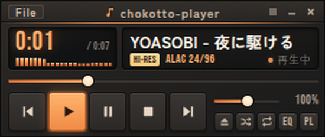
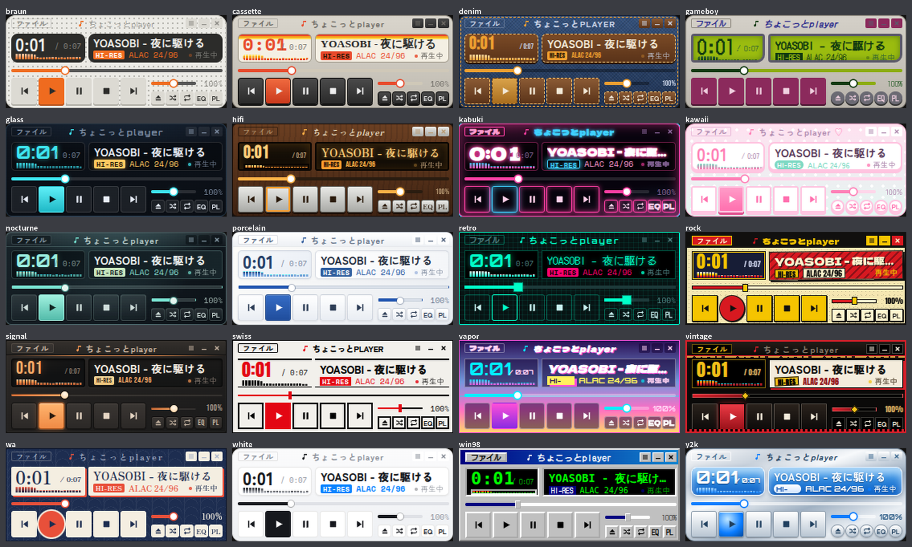

# ちょこっとplayer

ハイレゾ対応の、小さな音楽・動画プレイヤー（Windows 用）。



## ダウンロード（期間限定公開）

最新版は [Releases](https://github.com/flashpapa-sketch/chokotto-player/releases/latest) からどうぞ。

| ファイル | 内容 |
|---|---|
| `chokotto-player-1.1.1-setup.exe` | インストーラー版 |
| `chokotto-player-1.1.1-portable.zip` | インストール不要版（展開してすぐ使える） |
| `chokotto-player-1.1.1-mac.dmg` | Mac 版（Intel・Apple シリコン両対応）。CD 取り込みと右クリックメニューは Windows のみ |

**iPad・スマホ・Mac のブラウザ版**：https://flashpapa-sketch.github.io/chokotto-player/ （Safari の共有ボタン →「ホーム画面に追加」でアプリのように使えます）

## できること

- FLAC / ALAC / WAV / MP3 / AAC / OGG / OPUS などを再生。ALAC（Apple Lossless）にも対応
- ハイレゾ（24bit/96kHz など）の形式を表示。「ハイレゾ優先」で加工せずに出力
- 見た目は 20 種類（標準はシグナル・オレンジ）。スキンのフォルダに CSS を置けば自作スキンも追加可能。プレイリスト・イコライザ・CD取り込みの窓も同じ見た目になります
- 懐かしの `.wsz` クラシックスキンの読み込みに対応。本体の大きさも 275×116
- 10 バンドのイコライザ、プレイリスト
- エクスプローラーの右クリックに「ちょこっとPLAYERで開く」（複数選ぶとまとめてプレイリストに）
- タグから「アーティスト - 曲名」を表示。足りない曲名だけネットで補う機能つき（既定はオフ）
- 勝手に通信しない。履歴を残さない



## 初めて起動するとき

署名のないアプリのため、初回に「Windows によって PC が保護されました」と表示されることがあります。
「詳細情報」→「実行」で起動できます。ウイルスが見つかったという意味ではありません。

## Mac で初めて開くとき

Apple の署名がないため「開発元を確認できません」と出ることがあります。
アプリを右クリック →「開く」、または「システム設定 → プライバシーとセキュリティ」の「このまま開く」で起動できます。

## ファイルの確認（SHA-256）

```
99e8fca62a285960e1fd46cd98816104ddbef30c0012ea5652fa79fcc79ca001  chokotto-player-1.1.1-setup.exe
d75f12a26d8d50f3a5f82b6f6235d71c86c040f04f51e42037cf6e81a2b1d23e  chokotto-player-1.1.1-portable.zip
```

PowerShell で `Get-FileHash .\ファイル名` と打つと確かめられます。

## ライセンスについて

本体に含まれる第三者のソフトウェア（Electron、Chromium、libFLAC、LAME、ALAC デコーダ）と
同梱フォント（SIL Open Font License 1.1）の表記は、同梱の `THIRD-PARTY-NOTICES.txt` と
`fonts-licenses` フォルダをご覧ください。

本ソフトウェアは Winamp の開発元・権利者とは無関係です。

© 2026 Chokotto Software
